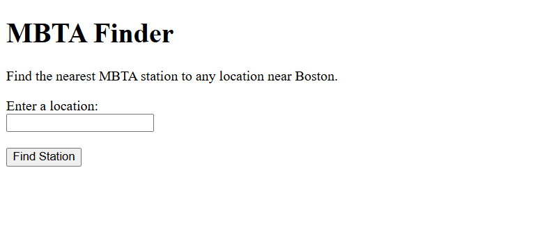
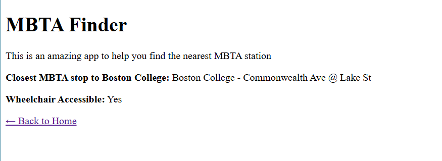
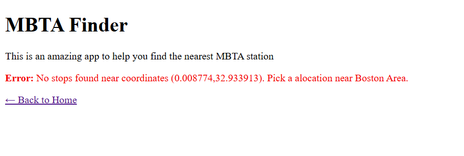
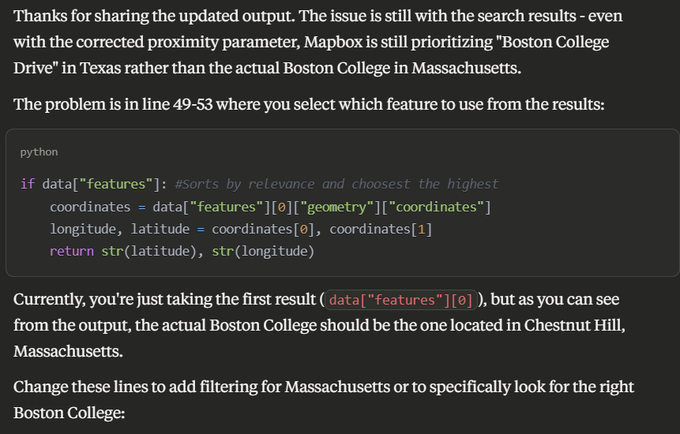

# MBTA Web App Project
### Contributers: Angel Vargas and George Guo
This is the base repository for Web App project. Please read the [instructions](instructions.md) for details.

## Project Write up and Reflection

### 1. Project Write up:
This project was an interesting assingment as we were required to create an HTML that asks the user to type a locaiton in Boston and return the closest MBTA station and whether it is weheelchair accessible. We wanted to implement additional features but decided to keep it plain and simple. In our project files, we mainly covered the following features: integrating APIs, geocoding, combining geocoding and user interface, and specific html pages that collects and processes user input.

### 2. Refelction
#### Development Process
Since the professor was nice enough to provide us with a roadmap with the set of funcitons, we were able to build our helper file based on the given logic. Our initial plan is to design a working helper file as this will be the main file doing most of the work. After that, we can create the complementary functions (app.py and html) without any issues.

After completing the helper, we had some issues trying to get the exact location and stops since python kept showing us many results across the US. Then we built app.py without any issues as we copied some of our old codes. 

#### Team's Work Devision
Originally, we attempted to code indivually but ran into several problems. An issue that we encoutnered (again, as we had the same issue with assignment 2) was collaborating in a coding environment. When we try to make a pull request (or at least we thought we did), the information never went through, and we found ourselves doing repetitive works. Additionally, we both struggled with our individual tasks at one point, and eventually we decided to meet up on Wednesday to create a cohesive code. 

#### Lessons Learned
Throuhough this proect we both learned how to create a funcitoning html with user interface and API integration. In this case, it was the MBTA and a map from mapbox. We also managed to create a two page html that runs based on user input. Moving forward, we will try adding and implementing more API's such as the map, time and distances. We can also do better on the designs. This also includes organizaiton, css and better formats.

We used ChatGPT as a debugger when something goes wrong. In most cases, we were able to receive a personalized response that we can translate into working codes. For instance, with our original version of the helper file, when the user types in a response, the function showed locations across the United States. We asked ChatGPT's input and we successfully limited the search region to Boston only (referring to image 3). ChatGPT is also great at helping us with the foramtting of the html pages. Both of us do not have any experience with html and formatting the pages was a difficult task. However, with AI's help, we were able to generate good looking and functing pages quickly.

